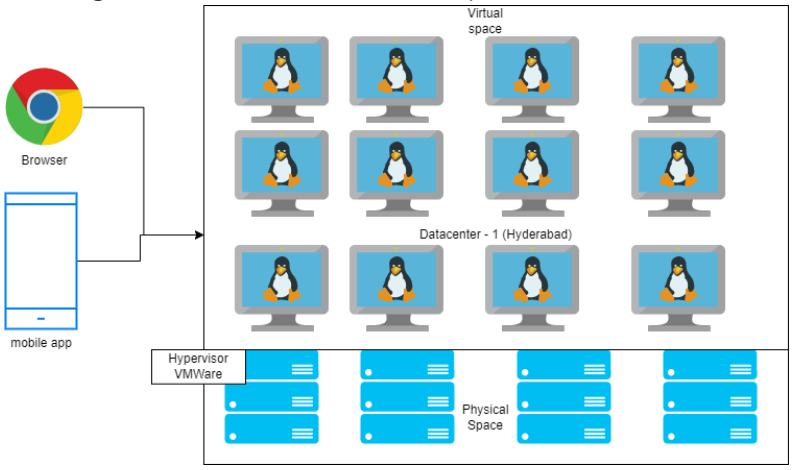

### Story of Organic India Corp ( some random organization )

* This organization runs an e-commerce application for selling organic fmcg
* This organization has it's Datacenter in Hyderabad



#### Problems

* From the 1st to 5th of every month, orders increase. Right now Organic India Corp has sixteen VMs where they are running backend services. Inspite of this, one of every five customers are facing latency issues and slow responses
* Right now this organization is running only in one Datacenter which is a single point of failure, so they have one more Datacenter with same number of servers in noida
* So, the architect of Organic India Corp has suggested to move to AWS ( cloud )

#### How can AWS solve these problems ?

* Let's understand basic merits of the AWS cloud :
    * _**Global presence**_
    * _**Elasticity**_ : Automatically increasing and decreasing the resources based on some dynamic metrics
    * _**Disaster Recovery**_ : It is easier to setup
    * _**Pay as you go**_

### Service Models : IaaS  v/s PaaS  v/s SaaS 


#### How to move to AWS ?

* _**Migration**_ : i.e. move the applications / data on your physical servers into AWS ( cloud )
* Migration based on workloads is classified into three types :
 1. Server Migration
 2. Database Migration
 3. Storage Migration

### Organic India Corp Application Architecture :


### Order of Migration

* Always from least dependent to most dependent
* In this case :
    * Storage Layer and DB Layer ( Least Dependent )
    * Application Layer
    * Presentation Layer ( Most Dependent )

### Migration Strategies => _**7R’s of Migration**_

 1.  _**RE-HOST**_ : Lift and shift ( running on On-premises = running in the Cloud )

 

 2. _**RE-PLATFORM**_ : Lift tinker and shift ( lifting with approximately required changes )

 

 3. _**RE-FACTOR / RE-ARCHITECT**_ : Re-write the complete application in a modern cloud native way ( example : shifting to microservices )

 4. _**RETAIN**_ ( postponing migration )

 5. _**RRETIRE**_ ( stopping migration )

 6. _**RE-PURCHASE**_ ( for using of internal tools )

 7. _**RE-LOCATE**_ ( having similar platform of work, both in On-premises and Cloud )

 

### HYPERVISOR Types

* Hypervisors are of two types :

 1. Type - I hypervisor

    

 2. Type - II hypervisor

    

* Virtualization

  

#### What does migration mean in the Context of Server ?

* Contents of the disk are replicated to AWS which will eventually create _**Amazon Machine Images (AMI)**_


* We will be migrating unique application hosted servers to AWS

### Migration approaches

* We have two approaches :
 1. One-time migration / replication
 2. On-going migration / replication 

### What is supported ways by AWS migration ?

* AWS Partner Network
* Agent V/S Agentless


### Assumptions

1. We are not seeking help from partner network
2. We are not using any third party applications, we are using AWS tools

### Migration Steps

* In AWS we are going to perform :
    * P2V ( Physical to Virtual)
    * V2V ( Virtual to Virtual )

### Simulating On-premises

* Since we don't have physical infra, we will be simulating this on cloud ( AWS / Azure )


### Migration Steps

* Workflow 

    [ Refer Here : https://docs.aws.amazon.com/mgn/latest/ug/migration-workflow-gs.html ]

* Limits 

    [ Refer Here : https://docs.aws.amazon.com/mgn/latest/ug/MGN-service-limits.html ]

* Supported OS 

    [ Refer Here : https://docs.aws.amazon.com/mgn/latest/ug/Supported-Operating-Systems.html ]

* Steps :


### Source Environment Prepartion

* For this activity we will be installing nopCommerce
* Overview of architecture :


* Create two AWS ubuntu linux instances _**( nop, dbserver )**_ of size `t2.micro` or `t3.micro` and security group opened for both `3306` and `5000` ports _**( open all - all tcp, all traffic )**_

* Consider one VM to be database server and install mysql
    * Steps: 
    
    [ Refer Here : https://www.digitalocean.com/community/tutorials/how-to-install-mysql-on-ubuntu-22-04 ]

    ```
    sudo apt update
    sudo apt install mysql-server -y
    sudo systemctl start mysql.service
    ```
    * In the mysql shell try to execute following commands 
    `username : nop , password : nop12345` :
    ```
    sudo mysql
    CREATE USER 'nop'@'localhost' IDENTIFIED BY 'nop12345';
    GRANT ALL PRIVILEGES ON *.* TO 'nop'@'localhost';
    FLUSH PRIVILEGES;
    exit
    ```
    * To verify the `nop` execute `mysql -u nop -p` and you should be allowed in sql shell
    ```
    show databases;
    Select user();
    ```


    * _**NOTE**_ : we need to fix the issue with external connectivity to the database

* Application : nopCommerce 

    [ Refer Here : https://docs.nopcommerce.com/en/installation-and-upgrading/installing-nopcommerce/installing-on-linux.html ]

* Steps :
    * Install .net core 7 
    
    [ Refer Here : https://learn.microsoft.com/en-us/dotnet/core/install/linux-ubuntu-install?pivots=os-linux-ubuntu-2004&tabs=dotnet8 ]

    * Install `Unzip` and download the nopCommerce zip file
    ```
     sudo apt install unzip -y 
    ```
    [ Refer here : https://docs.nopcommerce.com/en/installation-and-upgrading/installing-nopcommerce/installing-on-linux.html ]

    ```
    sudo mkdir /usr/share/nopCommerce
    cd /usr/share/nopCommerce/
    sudo wget https://github.com/nopSolutions/nopCommerce/releases/download/release-4.60.3/nopCommerce_4.60.3_NoSource_linux_x64.zip
    sudo unzip nopCommerce_4.60.3_NoSource_linux_x64.zip
    sudo mkdir bin
    sudo mkdir logs
    ```
    * To check whether application works type the command and expose the `http://<public_ip>:5000` over the browser
    ```
    sudo /usr/bin/dotnet Nop.Web.dll --urls "http://0.0.0.0:5000"
    ```
* Create a user called as `nop`
```
sudo uadduser nop
password :nop12345
```
* Give full permissions to `/usr/share/nopCommerce` to `nop`
```
sudo chgrp -R nop /usr/share/nopCommerce/
sudo chown -R nop /usr/share/nopCommerce/
```
* Create a file in `/etc/systemd/system/nopCommerce.service` with following content :
```
sudo vi /etc/systemd/system/nopCommerce.service
```
```
[Unit]
Description=Example nopCommerce app running on Xubuntu

[Service]
WorkingDirectory=/usr/share/nopCommerce
ExecStart=/usr/bin/dotnet /usr/share/nopCommerce/Nop.Web.dll
Restart=always
# Restart service after 10 seconds if the dotnet service crashes:
RestartSec=10
KillSignal=SIGINT
SyslogIdentifier=nopCommerce-example
User=nop
Environment=ASPNETCORE_ENVIRONMENT=Production
Environment=ASPNETCORE_URLS=http://0.0.0.0:5000
Environment=DOTNET_PRINT_TELEMETRY_MESSAGE=false

[Install]
WantedBy=multi-user.target
```
* Now execute with the following commands :
```
sudo systemctl enable nopCommerce.service
sudo systemctl start nopCommerce.service
sudo systemctl status nopCommerce.service
```
* Now access the application using `http://<ip-address>:5000`


* Enabling mysql connections from anywhere 

    [ Refer Here : https://www.techrepublic.com/article/create-mysql-8-database-user-remote-access-databases/ ]

* Step-1 :

* The first thing we must do is configure MySQL for remote connections. To do this, log into your MySQL database server and open the configuration file with the command :
```
sudo nano /etc/mysql/mysql.conf.d/mysqld.cnf
```
* In that file, look for the line :
```
bind-address = 127.0.0.1
```
* Change that line to :
```
bind-address = 0.0.0.0
```
* Save and close the file. Restart the MySQL service with :
```
sudo systemctl restart mysql
sudo systemctl status mysql
```
* Step-2 : Launch mysql shell `sudo mysql`
```
CREATE USER 'nop'@'%' IDENTIFIED BY 'nop12345';
GRANT ALL PRIVILEGES ON *.* to 'nop'@'%';
FLUSH PRIVILEGES;
exit
```
* Let's configure ecommerce application in webpage `http://<ip-address>:5000` and create some sample data
* Enter database details and credentials `nop / nop12345`
* restart and wait for few minutes for the page to be reloaded


### AWS Migration P2V 

* For the doc's :

    [ Refer Here : https://docs.aws.amazon.com/mgn/latest/ug/what-is-application-migration-service.html ] 

* For the first time setup guide :

    [ Refer Here : https://docs.aws.amazon.com/mgn/latest/ug/first-time-setup-gs.html ]

* Steps :

=> Navigate to Application Migration Service => Set up Application => Set up service


=> Source servers => Add server


* Create a user with AWS Application Migration Agent Installation Policy 
* Now follow the instructions as mentioned in the page :

=> AWS Replication Agent installation => Select operating system : Linux => Select replication preferences : Replicate all disks => provide required credentials => IAM access key ID :   => IAM secret access key :  


=> copy the input command for the source server => Back


=> On the command line, run the command copied earlier


=> follow the following commands for installing Replication Agent:
```
ls
sudo python3 aws-replication-installer-init.py --region ap-south-1 --aws-access-key-id '' --aws-secret-access-key '' --no-prompt 
```


* We will continue from the state where initial sync is complete

* We are continuing on migration, we need to wait for initial sync to complete and then start replication


* We were able to launch test instances, finalize testing, launch cutover instances and finalize cutover

### AWS Database Migration Service

* Overview


* We will be migrating from on-prem mysql to AWS rds for mysql
* Let's create an AWS rds for mysql
* Let's create replication instances
* Let's create a migration task
* Wait till the migration gets completed

### Storage Migration

* AWS supports two types of storage migrations :
    * _**Online**_ :
        * Snowball edge
        * Storage Gateway with local tape gateway, file gateway and volume gateway
    * _**Offline**_ : To perform offline transfers we have AWS Snow Family devices
        * Snowcone
        * Snowball
        * Snowmobile

### Modernization

* After workloads are migrated to AWS, we can modernize them to Cloud Native Architectures
* Popular options
    * Microservices
        * Event based Micro-services
    * Serverless
    * Data architectures
        * Data lakes
        * Data Analytics
        * Integration with AI/ML

### AWS Backup and Disaster Recovery

* BCDR (Business Continuity and Disaster Recovery)


### AWS Backup Service

* Supported Resources 

    [ Refer Here : https://docs.aws.amazon.com/aws-backup/latest/devguide/whatisbackup.html#supported-resources ]

#### Creating a Backup for EC2 instance

* Create an ec2 instance and install something
* Let's create a backup plan


* Ensure you choose resources filtered by tags
* Wait for the schedule to see the backup or we can create an on-demand backup